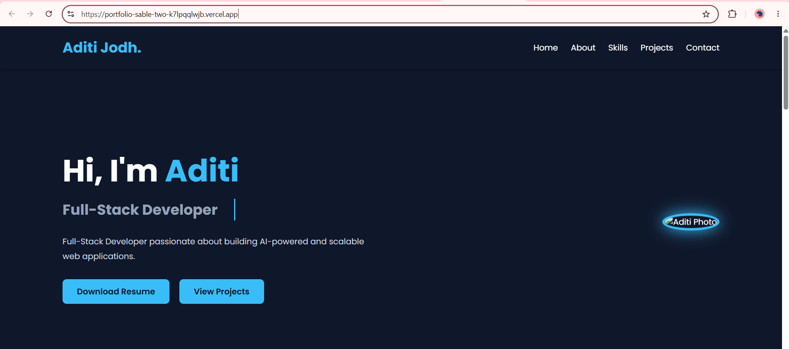
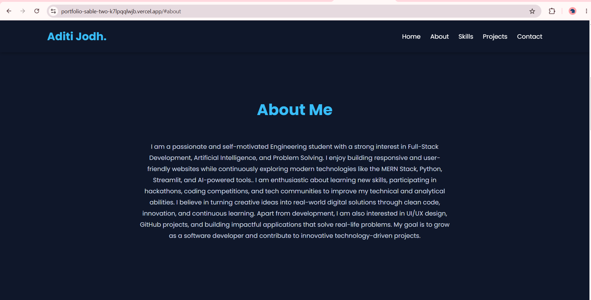
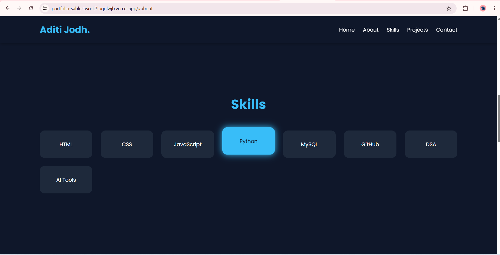
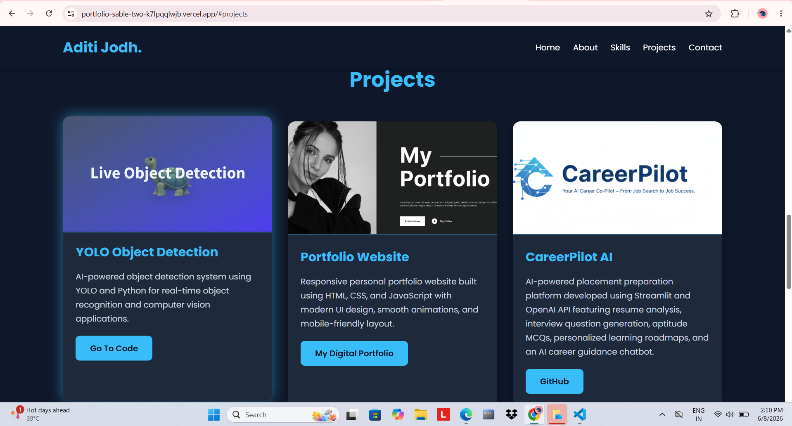
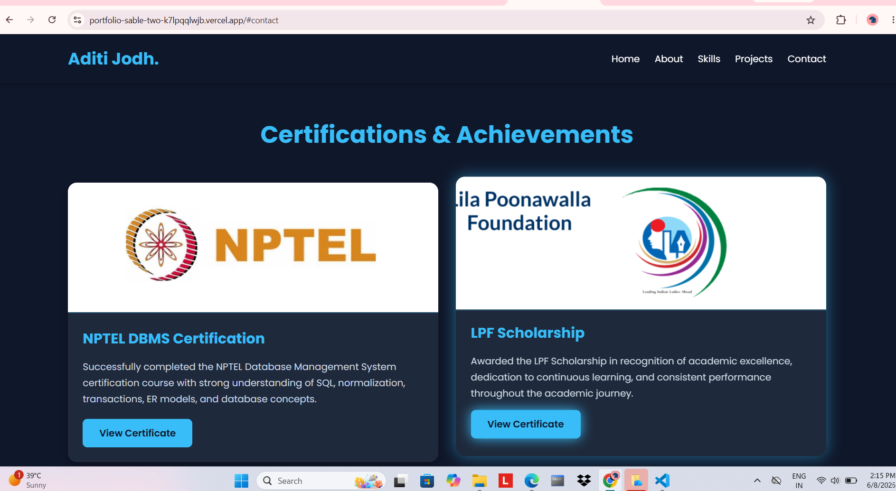
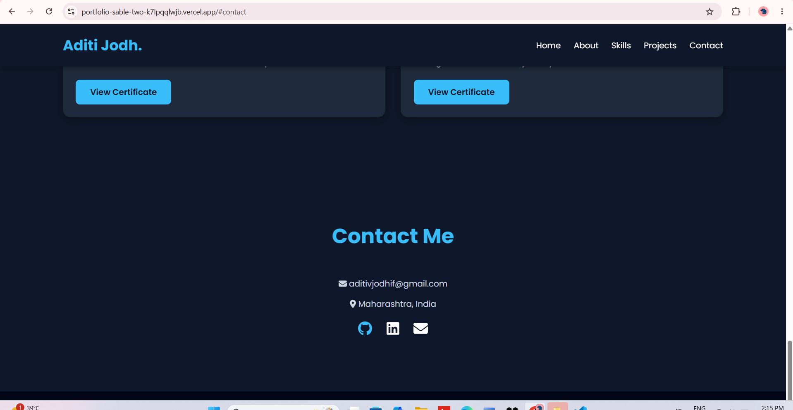

# 🌟 Personal Portfolio Website

A modern, responsive, and professional portfolio website showcasing my skills, projects, achievements, and journey as an aspiring Software Engineer.

## 🚀 Live Demo

🔗 Portfolio Website:(https://portfolio-sable-two-k7lpqqlwjb.vercel.app/)

## ✨ Features

- Responsive Design for all devices
- Professional Landing Page
- About Me Section
- Skills & Technologies Showcase
- Projects Portfolio
- Resume Download Option
- Contact Form
- Social Media Integration
- Smooth Animations and Modern UI

## 🛠️ Tech Stack

### Frontend
- HTML5
- CSS3
- JavaScript
- React.js
- Tailwind CSS

### Tools & Platforms
- Git
- GitHub
- Vercel / Netlify
- VS Code

## 📸 Portfolio Sections

### Home
Introduction and professional summary.

### About
Educational background and career goals.

### Skills
Technical skills and technologies.

### Projects
Featured projects with descriptions and links.

### Resume
Downloadable resume for recruiters.

### Contact
Easy ways to connect and collaborate.

## 📸 Portfolio Preview

### Home Page

### About Section

### Skills Section

### Projects Section

### Certification Section

### Contact Section

## 📈 Future Improvements

- Blog Section
- Dark Mode
- Project Filtering
- Admin Dashboard
- Visitor Analytics
- AI-powered Chat Assistant

## 🤝 Connect With Me

### GitHub
https://github.com/aditijodh28

### LinkedIn
(https://www.linkedin.com/in/aditi-jodh-957318378/)

### Email
aditivjodhif@gmail.com

## ⭐ Deployment

This project is deployed and publicly accessible online for recruiters and developers to explore.

⭐ If you like this project, don't forget to star the repository.
